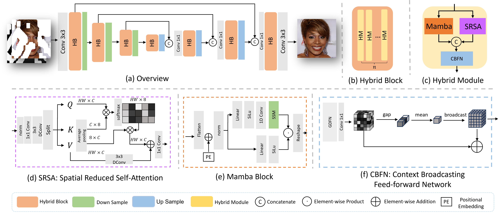

# MxT: Mamba x Transformer for Image Inpainting (BMVC 2024)
========================================================================================

Image inpainting, or image completion, is a crucial task in computer vision that aims to restore missing or damaged regions of images with semantically coherent content. This technique requires a precise balance of local texture replication and global contextual understanding to ensure the restored image integrates seamlessly with its surroundings. Traditional methods using Convolutional Neural Networks (CNNs) are effective at capturing local patterns but often struggle with broader contextual relationships due to the limited receptive fields. Recent advancements have incorporated transformers, leveraging their ability to understand global interactions. However, these methods face computational inefficiencies and struggle to maintain fine-grained details. To overcome these challenges, we introduce MxT composed of the proposed Hybrid Module (HM), which combines Mamba with the transformer in a synergistic manner. Mamba is adept at efficiently processing long sequences with linear computational costs, making it an ideal complement to the transformer for handling long-scale data interactions. Our HM facilitates dual-level interaction learning at both pixel and patch levels, greatly enhancing the model to reconstruct images with high quality and contextual accuracy. We evaluate MxT on the widely-used CelebA-HQ and Places2-standard datasets, where it consistently outperformed existing state-of-the-art methods.


Paper Download:[MxT: Mamba x Transformer for Image Inpainting](https://arxiv.org/html/2407.16126v1)

========================================================================================
**Overview**
--------------------


## News
- [x] Training Code
- [x] Pre-trained Models
- [ ] Code for large resolution


**Dataset**
--------------------
For the full CelebA-HQ dataset, please refer to http://mmlab.ie.cuhk.edu.hk/projects/CelebA.html

For the full Places2 dataset, please refer to http://places2.csail.mit.edu/download.html

For the irrgular mask dataset, please refer to http://masc.cs.gmu.edu/wiki/partialconv

Please use `script/flist.py` to create `.flist` file for training and testing.


**Initialization**
--------------------
* Clone this repo:
```
git clone https://github.com/ChrisChen1023/MxT
cd MxT-main
```
Python >=3.7

PyTorch

causal-conv1d 

mamba-ssm

If you got problem during setting Mamba, please refer to https://github.com/bowang-lab/U-Mamba

**Pre-trained model**
--------------------
We released the pre-trained model 
[Google Drive](https://drive.google.com/drive/folders/1s_EqqBkJRy9VE_1OUD9rLhqua2LwtBXQ?usp=drive_link)


**Getting Started**
----------------------
[Download pre-trained model]
Download the pre-trained model to `./checkpoints`

[Data Preparation]
Download the Datasets, use `script/flist.py` to create `.flist` file for training and testing.
Set your own `config.yml` with the corresponding filst paths at 'TEST_INPAINT_IMAGE_FLIST', 'TRAIN_INPAINT_IMAGE_FLIST', 'TRAIN  _MASK_FLIST' and 'TEST_MASK_FLIST'. Set the `--MAKS 3` for the mixed mask index (for training), and  `--MAKS 6` for the fixed mask index (for testing).

run:
```
python train.py
```
For testing, in `config.yml`, set the `--MAKS 6` for the fixed mask index, then run:
```
python test.py
```


**Citation**

If you find this work helpful, please cite us.
```
@inproceedings{chen24mxt,
 author={Chen, Shuang and Atapour-Abarghouei, Amir and Zhang, Haozheng and Shum, Hubert P. H.},
 booktitle={Proceedings of the 2024 British Machine Vision Conference},
 series={BMVC '24},
 title={MxT: Mamba x Transformer for Image Inpainting},
 year={2024},
 location={Glasgow, UK},
}
